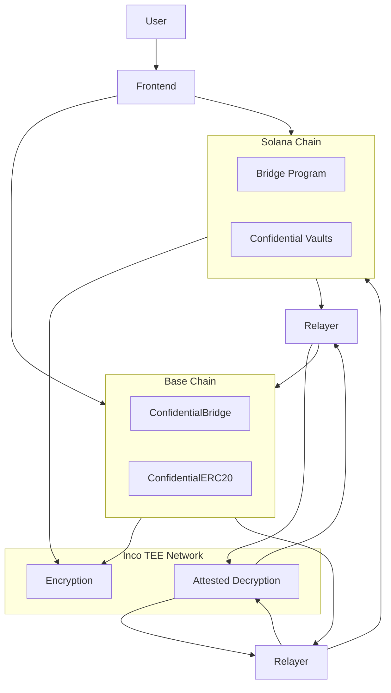

# DarkBridge

DarkBridge is a privacy-preserving cross-chain bridge that enables confidential token transfers between Base (Ethereum L2) and Solana. It leverages Inco Network's Trusted Execution Environment (TEE) technology to ensure that transaction amounts, balances, and participant identities remain hidden from on-chain observers.

## Table of Contents

1. [Overview](#overview)
2. [Privacy Features](#privacy-features)
3. [Architecture](#architecture)
4. [Technology Stack](#technology-stack)
5. [How It Works](#how-it-works)
6. [Security Model](#security-model)
7. [Project Structure](#project-structure)
8. [Getting Started](#getting-started)
9. [Deployment](#deployment)
10. [Testing](#testing)
11. [API Reference](#api-reference)

---

## Overview

Traditional cross-chain bridges expose all transaction details publicly on-chain. Anyone can see who is transferring tokens, how much they are moving, and where the tokens are going. This transparency creates significant privacy concerns:

- Wealth tracking and profiling
- Front-running and MEV extraction
- Correlation of addresses across chains
- Exposure of trading strategies

DarkBridge solves these problems by integrating Inco Lightning, a confidentiality layer that uses hardware-based Trusted Execution Environments to process encrypted data. The result is a bridge where transaction amounts are never visible on-chain, balances are stored encrypted, and users can optionally hide their sender and receiver addresses.

---

## Privacy Features

DarkBridge implements three levels of privacy protection:

### Amount Privacy

All token amounts are encrypted before being stored or transmitted on-chain. The encrypted values are represented as opaque handles that reference private data stored securely within Inco's TEE network. On-chain observers can see that a bridge transaction occurred, but cannot determine the actual amount being transferred.

### Sender Privacy

Users can submit bridge transactions through a relayer service. When using this method, the user signs an EIP-712 typed message off-chain, and the relayer submits the transaction on their behalf. On-chain, only the relayer's address appears as the transaction sender, protecting the user's identity.

### Receiver Privacy

DarkBridge supports a commitment-claim system for receiver privacy. Instead of specifying a destination address directly, users provide a cryptographic commitment (hash of a secret). The recipient can later claim the tokens by revealing the secret. The receiver's address only becomes visible at claim time, breaking the on-chain link between sender and receiver.

---

## Architecture

DarkBridge consists of four main components that work together to enable private cross-chain transfers.

### High-Level Architecture Diagram



### Base Contracts (Solidity)

The EVM side of the bridge runs on Base and includes:

- **ConfidentialBridge**: The main entry point for bridge operations. Handles token locking/unlocking, message emission, and cross-chain coordination. Integrates with Inco Lightning for encrypted amount processing.

- **ConfidentialCrossChainERC20**: An ERC20 token implementation where all balances are stored as encrypted handles. Supports standard token operations (transfer, approve, transferFrom) while keeping amounts hidden.

- **Bridge**: The core messaging contract that handles proof verification and message relay from Solana.

- **Twin**: Execution contracts deployed for each Solana sender, enabling authorized cross-chain calls.

### Solana Programs (Rust/Anchor)

The Solana side consists of two Anchor programs:

- **Bridge Program**: Manages cross-chain messaging, output root registration, message proving, and relay operations. Includes confidential vault support for encrypted balance storage.

- **Base Relayer Program**: Handles gas payment and message relay coordination for Solana-to-Base transfers.

### Frontend Application (Next.js)

A web application that provides:

- Wallet connection for both EVM (via RainbowKit) and Solana (via Wallet Adapter)
- Bridge interface for initiating transfers in either direction
- Vault management for viewing encrypted balances
- Documentation and guides

### Relayer Services

Background services that monitor bridge events and relay messages between chains:

- **Base-to-Solana Relayer**: Watches for bridge initiation events on Base, decrypts amounts via Inco attestation, and submits corresponding transactions on Solana.

- **Solana-to-Base Relayer**: Monitors Solana bridge events and relays messages to Base with appropriate proofs.

---

## Technology Stack

### Blockchain Infrastructure

| Component | Technology | Purpose |
|-----------|------------|---------|
| EVM Chain | Base (Ethereum L2) | Primary chain for ERC20 operations |
| SVM Chain | Solana | High-throughput destination chain |
| Privacy Layer | Inco Lightning | TEE-based encrypted computation |

### Smart Contract Development

| Component | Technology | Version |
|-----------|------------|---------|
| EVM Framework | Foundry (Forge) | Latest |
| Solidity | 0.8.28 | With IR optimizer |
| Solana Framework | Anchor | 0.30.x |
| Rust | 1.75+ | Stable |

### Frontend and Services

| Component | Technology | Version |
|-----------|------------|---------|
| Framework | Next.js | 14.2.x |
| Language | TypeScript | 5.x |
| EVM Wallet | RainbowKit + wagmi | 2.x |
| Solana Wallet | Wallet Adapter | 0.15.x |
| Styling | Tailwind CSS | 3.4.x |
| Runtime | Bun | Latest |

### Key Dependencies

| Package | Purpose |
|---------|---------|
| @inco/lightning | Solidity library for encrypted operations |
| @inco/js | JavaScript SDK for client-side encryption |
| @inco/solana-sdk | Solana SDK for Inco operations |
| viem | EVM interactions and encoding |
| @solana/web3.js | Solana RPC and transaction building |
| solady | Gas-optimized Solidity utilities |

---

## How It Works

### Encryption Model

DarkBridge uses Inco Lightning's TEE-based encryption system. Unlike Fully Homomorphic Encryption (FHE), which performs computations directly on encrypted data, Inco Lightning uses hardware secure enclaves:

1. **Handle-Based Storage**: Encrypted values are stored on-chain as opaque handles (bytes32 on EVM, u128 on Solana). These handles are references to private data stored within Inco's TEE network.

2. **Secure Computation**: When operations are needed (addition, comparison, etc.), the request is sent to Inco's TEE network. The TEE decrypts the operands, performs the computation inside the secure enclave, re-encrypts the result, and returns a new handle.

3. **Access Control**: Each encrypted handle has an associated access list. Only authorized addresses can request decryption of a value. This is managed through the `allow()` function.

4. **Attestation**: Inco's covalidator network provides signed attestations proving that computations were performed correctly inside authentic TEE hardware.

### Base to Solana Transfer Flow

1. **User Encryption**: The user encrypts the transfer amount using the Inco JavaScript SDK. This creates a ciphertext that only Inco's TEE can process.

2. **Bridge Initiation**: The user calls `bridgePrivateToSolana()` on the ConfidentialBridge contract, providing the encrypted amount and destination Solana address.

3. **Token Burn**: The contract creates an encrypted handle from the ciphertext, verifies the user has sufficient balance (encrypted comparison), and burns the tokens from their encrypted balance.

4. **Event Emission**: A `ConfidentialBridgeInitiated` event is emitted containing the encrypted handle (not the plaintext amount).

5. **Relayer Processing**: The relayer observes the event, requests attested decryption from Inco, and obtains the verified plaintext amount.

6. **Solana Minting**: The relayer calls the Solana bridge program to mint tokens to the recipient's confidential vault. A new encrypted handle is created on Solana.

7. **Balance Update**: The recipient's vault balance is updated using encrypted addition, and they are granted decryption access to view their new balance.

### Solana to Base Transfer Flow

1. **Vault Withdrawal**: The user initiates a withdrawal from their Solana confidential vault, specifying an encrypted amount and destination EVM address.

2. **Balance Deduction**: The program verifies sufficient balance (encrypted comparison) and subtracts the amount from the vault.

3. **Message Creation**: An outgoing message is created containing the transfer details.

4. **Relayer Relay**: The relayer detects the message, obtains any necessary proofs, and submits the relay transaction to Base.

5. **Token Minting**: The Base bridge mints tokens to the recipient's encrypted balance on the ConfidentialCrossChainERC20 contract.

---

## Security Model

### Threat Mitigation

| Threat | Mitigation |
|--------|------------|
| Amount Leakage | All amounts encrypted; only handles visible on-chain |
| Balance Tracking | Balances stored as encrypted handles with access control |
| Front-Running | Relayers cannot see actual amounts; MEV protection inherent |
| Handle Substitution | Handle verification on receive prevents swap attacks |
| Replay Attacks | Nonce tracking for all bridge operations |
| Unauthorized Decryption | Explicit allow() grants required; TEE enforces access |

### Trust Assumptions

1. **TEE Hardware**: The security of encrypted data relies on the integrity of Inco's TEE hardware (Intel SGX/TDX). Attestation proofs verify authentic hardware execution.

2. **Inco Network**: The Inco covalidator network must remain available and honest. Multiple validators sign attestations, providing redundancy.

3. **Relayer Integrity**: While relayers cannot see amounts, they must relay transactions faithfully. Permissioned relayer roles with monitoring provide accountability.

4. **Smart Contract Correctness**: The bridge contracts have been designed with standard security patterns including reentrancy guards, access controls, and input validation.

### Access Control

- **Guardian Role**: Administrative functions for configuration and emergency pause
- **Relayer Role**: Authorized accounts for submitting cross-chain messages
- **User Permissions**: Automatic decryption grants for balance holders

---

## Project Structure

```
dark-bridge/
    base/                       # EVM smart contracts (Foundry)
        src/
            Bridge.sol                  # Core bridge logic
            ConfidentialBridge.sol      # Privacy bridge extension
            ConfidentialCrossChainERC20.sol  # Encrypted ERC20
            CrossChainERC20.sol         # Standard wrapped token
            CrossChainERC20Factory.sol  # Token factory
            Twin.sol                    # Execution contracts
            interfaces/                 # Contract interfaces
            libraries/                  # Utility libraries
            mocks/                      # Test mocks
        script/                 # Deployment scripts
        test/                   # Test suites
        deployments/            # Deployment addresses
    
    solana/                     # Solana programs (Anchor)
        programs/
            bridge/             # Main bridge program
            base_relayer/       # Gas relay program
        keypairs/               # Program keypairs
        target/                 # Build output
    
    frontend/                   # Next.js web application
        src/
            app/                # Next.js app router pages
            components/         # React components
            lib/                # Utility functions
        public/                 # Static assets
    
    clients/                    # TypeScript client libraries
        ts/
            src/                # Bridge client implementations
    
    scripts/                    # Operational scripts
        src/
            commands/           # CLI commands
            internal/           # Internal utilities
            utils/              # Shared utilities
    
    services/                   # Background services
        base-to-solana-relayer/ # B2S relay service
        solana-to-base-relayer/ # S2B relay service
    
    docs/                       # Documentation
```

---

## Getting Started

### Prerequisites

- Node.js 18+ or Bun runtime
- Foundry toolchain (forge, cast, anvil)
- Rust 1.75+ with Solana CLI
- Anchor 0.30.x
- An EVM wallet (MetaMask, Coinbase Wallet)
- A Solana wallet (Phantom, Backpack)

### Installation

Clone the repository and install dependencies for each component:

```bash
# Clone repository
git clone https://github.com/gks2022004/dark-bridge.git
cd dark-bridge

# Install frontend dependencies
cd frontend
npm install

# Install base contract dependencies
cd ../base
forge install
npm install

# Install Solana program dependencies
cd ../solana
bun install

# Install scripts dependencies
cd ../scripts
bun install
```

### Environment Configuration

Create environment files for each component:

**Frontend (.env.local)**
```
NEXT_PUBLIC_WALLETCONNECT_PROJECT_ID=your_project_id
EVM_PRIVATE_KEY=0x...
SOLANA_PRIVATE_KEY=[...]
CRON_SECRET=your_cron_secret
```

**Scripts (.env)**
```
EVM_PRIVATE_KEY=0x...
SOLANA_PRIVATE_KEY=[...]
BASE_RPC_URL=https://sepolia.base.org
SOLANA_RPC_URL=https://api.devnet.solana.com
```

### Running Locally

Start the frontend development server:

```bash
cd frontend
npm run dev
```

The application will be available at `http://localhost:3000`.

### Running Relayers

In separate terminals, start the relayer services:

```bash
# Base to Solana relayer
cd scripts
EVM_PRIVATE_KEY=0x... bun run src/privacy-relayer-base-to-sol.ts --monitor

# Solana to Base relayer
cd scripts
EVM_PRIVATE_KEY=0x... bun run src/privacy-relayer-sol-to-base.ts --monitor
```

---

## Deployment

### Base Contracts

Deploy using Foundry's deployment scripts:

```bash
cd base

# Deploy to Base Sepolia testnet
make deploy

# Deploy confidential contracts
forge script script/DeployConfidential.s.sol --rpc-url base_sepolia --broadcast

# Verify contracts
forge verify-contract <address> ConfidentialBridge --chain base-sepolia
```

### Solana Programs

Build and deploy using Anchor:

```bash
cd solana

# Build for devnet
bun run program:build devnet-alpha

# Deploy to devnet
bun run program:deploy devnet-alpha

# Initialize bridge state
bun run tx:initialize devnet-alpha
```

### Frontend (Vercel)

The frontend is designed for deployment on Vercel:

1. Connect your repository to Vercel
2. Configure environment variables in the Vercel dashboard
3. Deploy automatically on push to main branch

The relayer API routes will run as serverless functions, with cron jobs handling automated relay operations.

---

## Testing

### Base Contract Tests

```bash
cd base

# Run all tests
forge test

# Run fork tests against Base Sepolia
forge test --fork-url https://sepolia.base.org -vvv

# Run specific test file
forge test --match-contract ConfidentialBridgeForkTest --fork-url https://sepolia.base.org -v

# Generate coverage report
make coverage
```

### Solana Program Tests

```bash
cd solana

# Run unit tests
cargo test

# Run integration tests
anchor test
```


---

## API Reference

### ConfidentialBridge Contract

**bridgePrivateToSolana**
```solidity
function bridgePrivateToSolana(
    address localToken,
    bytes32 toSolana,
    bytes calldata encryptedAmount
) external payable
```
Initiates a private bridge transfer from Base to Solana. The encryptedAmount is a ciphertext created using the Inco JavaScript SDK.

**bridgePrivateViaRelayer**
```solidity
function bridgePrivateViaRelayer(
    address localToken,
    bytes32 commitment,
    bytes calldata encryptedAmount,
    address sender,
    uint256 senderNonce,
    uint256 deadline,
    bytes calldata signature
) external onlyRoles(RELAYER_ROLE)
```
Submits a bridge transaction on behalf of a user for sender privacy. Requires a valid EIP-712 signature from the actual sender.

**redeemClaim**
```solidity
function redeemClaim(uint256 claimId, bytes32 secret) external
```
Claims tokens using a secret that matches the commitment hash. Reveals the recipient address only at claim time.

### ConfidentialCrossChainERC20 Contract

**confidentialMint**
```solidity
function confidentialMint(address to, euint256 amount) external onlyBridge
```
Mints encrypted tokens to an address. Only callable by the bridge contract.

**transfer**
```solidity
function transfer(address to, euint256 amount) external returns (bool)
```
Transfers encrypted tokens between accounts. The amount remains encrypted throughout the operation.

**balanceOf**
```solidity
function balanceOf(address account) external view returns (euint256)
```
Returns the encrypted balance handle for an account. The actual balance can only be decrypted by authorized addresses.

### Solana Bridge Program

**bridge_confidential_out**
```
pub fn bridge_confidential_out(
    ctx: Context<BridgeConfidentialOut>,
    encrypted_amount: Vec<u8>,
    destination: [u8; 20]
) -> Result<()>
```
Initiates a confidential bridge transfer from Solana to Base.

**receive_confidential_in**
```
pub fn receive_confidential_in(
    ctx: Context<ReceiveConfidentialIn>,
    nonce: u64,
    encrypted_amount: Vec<u8>
) -> Result<()>
```
Receives and processes an incoming confidential transfer from Base.

---

## License

This project is licensed under the MIT License. See the LICENSE file for details.

---

## Acknowledgments

- Inco Network for the Lightning confidentiality layer
- Base team for the L2 infrastructure
- Solana Foundation for the high-performance runtime
- OpenZeppelin for security patterns and contract libraries
- Solady for gas-optimized utilities
